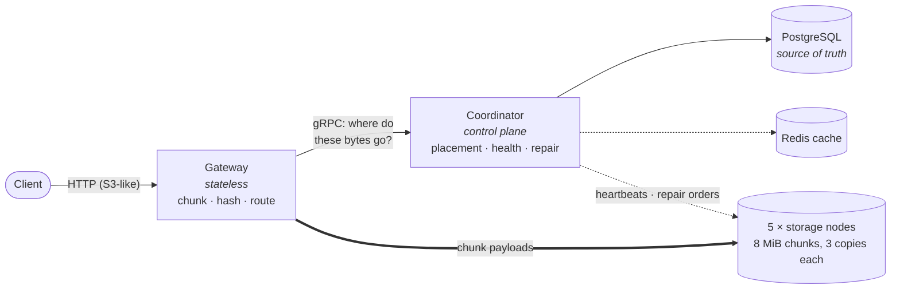

# FlexStore

**FlexStore is a small distributed object store written in Go : an S3-inspired
system built to understand how storage survives failure.** A coordinator
manages metadata in PostgreSQL; five storage nodes hold the actual bytes. Every
file is split into 8 MiB chunks, each chunk is stored on 3 different nodes, and
when a node dies the cluster notices by itself and rebuilds the missing copies.


## How it works



One rule shapes the design: **object bytes never pass through the
coordinator.** It only answers "where should these bytes live?" Data flows
directly between client, gateway and storage nodes and repairs are pulled
node-to-node, so the control plane never becomes the data bottleneck.

- **Write:** the gateway streams the upload in 8 MiB chunks, hashes each one,
  asks the coordinator for 3 target nodes and writes to all 3 in parallel. A
  chunk is accepted once 2 nodes have fsynced it; repair converges the third
  copy. The object becomes visible in one atomic step at the end, readers
  never see a half-uploaded file.
- **Read:** for each chunk the gateway picks a replica, **verifies its SHA-256
  before sending a single byte onward** and silently fails over to another
  replica if the node is down or the bytes are wrong.
- **Node failure:** miss heartbeats for 45s and the node is declared dead. An
  indexed query finds every chunk that lost a copy, repair jobs go into a
  crash-safe queue in PostgreSQL and surviving nodes copy chunks directly to
  each other until everything is back at 3 copies. A returning node is not
  trusted: its files are re-verified against recorded hashes first.

Deeper reading: [architecture](docs/architecture.md) ·
[failure recovery](docs/failure-recovery.md)

## Try it

Prerequisites: Docker with Compose. Go itself runs inside containers.

```bash
git clone https://github.com/harjeet-chahal/FlexStore.git
cd FlexStore
make up        # gateway, coordinator, 5 storage nodes, PostgreSQL, Redis
make smoke     # upload 25 MiB, download it, compare SHA-256
```

Then open **http://localhost:8080/dashboard** and break something:

```bash
SIZE_MIB=128 make demo   # upload → kill a node → watch it heal → verify checksum
```

The demo uploads a file, kills the node holding most of its chunks, proves the
file still downloads while degraded, waits for repair and compares checksums.
Every number it prints is queried live from the cluster. `KILL_TWO=1 make demo`
kills two nodes.


Multipart uploads (`POST /multipart/...`, parts in parallel, any order) and a
read-only admin API (`/admin/health`, `/admin/nodes`, `/admin/replication`,
`/admin/objects/{bucket}/{key}`) round it out. Every error returns one JSON
envelope with a request ID.

## Measured behaviour

All measured an on one laptop (Apple M4 Pro).

**Failure recovery** (3 trials: upload 512 MiB, kill the node holding the most
of it, measure until all chunks are back at 3 copies):

| | Trial 1 | Trial 2 | Trial 3 |
|---|---:|---:|---:|
| Node death detected after | 43.3 s | 47.8 s | 46.5 s |
| Chunks that lost a copy | 44 | 46 | 50 |
| All copies rebuilt (after detection) | **13.0 s** | **8.2 s** | **9.5 s** |
| Reads during recovery | 236/236 | 235/235 | 213/213 |
| Data intact after (SHA-256) | yes | yes | yes |

Detection (the 45s heartbeat timeout) dominates; the copying itself takes
seconds.

**Throughput** (5 nodes, 3× replication, 8 concurrent clients, zero errors):

| Object size | Upload | Download | p95 latency (up / down) |
|---|---:|---:|---:|
| 8 MiB | 528 MiB/s | 2,673 MiB/s | 173 ms / 40 ms |
| 128 MiB | 424 MiB/s | 1,731 MiB/s | 2.9 s / 0.8 s |

Upload is roughly 4–5× slower than download because every uploaded byte is
written to three nodes and fsynced; reads come from one.


## Limitations

- **The coordinator is a single point of failure.** If it dies, reads and
  writes stop until it restarts (seconds; nothing is lost, repairs resume).
- **PostgreSQL is the real single point of failure** — no replication or
  backups here. Losing it loses the metadata.

## License & contact

MIT — see [LICENSE](LICENSE).

Built by **Harjeet Singh Chahal** ·
