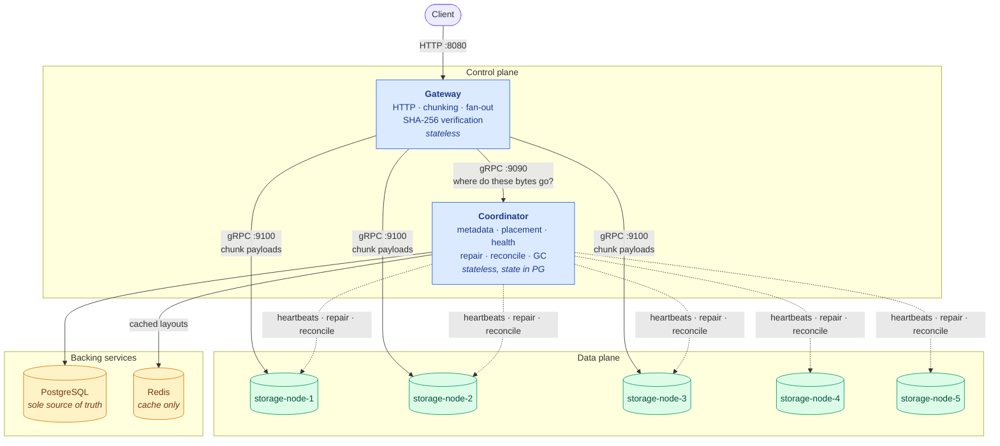
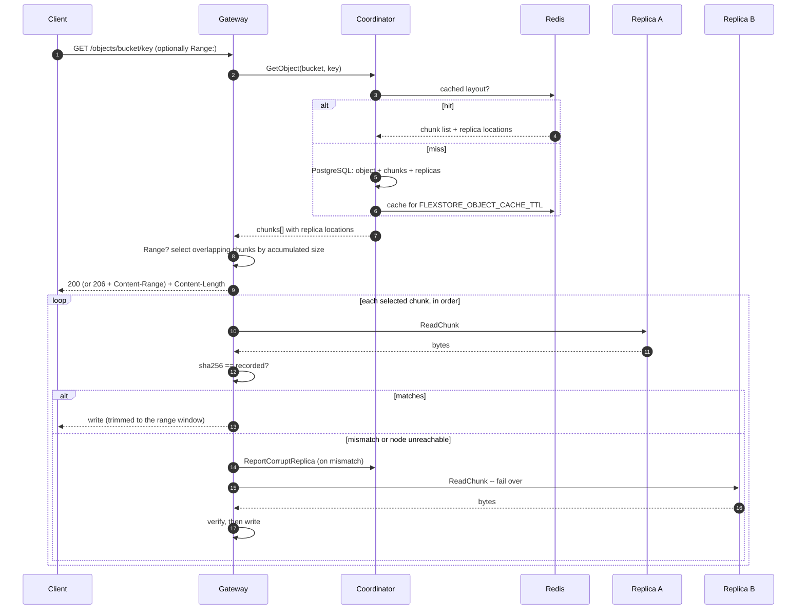
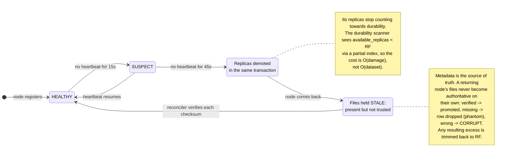
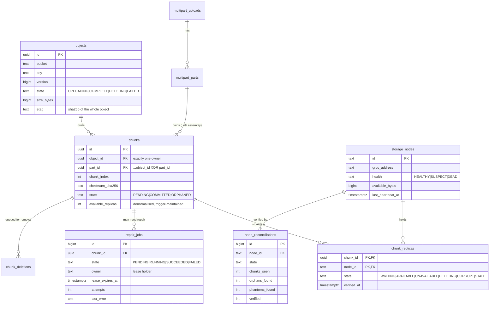

# Architecture

How FlexStore is put together, and why each boundary is where it is.

---

## Contents

1. [The system in one diagram](#the-system-in-one-diagram)
2. [Components](#components)
3. [The PUT path](#the-put-path)
4. [The GET path](#the-get-path)
5. [Node failure and recovery](#node-failure-and-recovery)
6. [Data model](#data-model)
7. [Where state lives](#where-state-lives)
8. [Why these boundaries](#why-these-boundaries)
9. [Design trade-offs worth knowing](#design-trade-offs-worth-knowing)
10. [Package map](#package-map)

---

## The system in one diagram



**The one structural rule:** object bytes flow *only* between the client, the
gateway and the storage nodes. The coordinator never touches a payload — it
answers "where do these bytes go" and "where do these bytes live", and that is
all. Repair is pull-based for the same reason: the destination node fetches from
the source node directly, so restoring a terabyte does not put a terabyte
through the control plane.

---

## Components

| Component | Responsibility | Holds data? | Scales? |
|---|---|---|---|
| **Gateway** | S3-like HTTP API, chunking, replica fan-out, read failover, SHA-256 verification, Range requests | No | Yes, horizontally |
| **Coordinator** | Object/chunk metadata, placement, node health, repair queue, reconciliation, GC | No — everything in PostgreSQL | Not today: singleton workers have no leader election |
| **Storage node** | Content-addressed chunk files, fsync, checksum on write, inventory streaming | **Yes** | Yes, by adding nodes |
| **PostgreSQL** | Sole source of truth for all metadata | Yes | Single instance |
| **Redis** | Object layout cache. Optional | No — losing it costs latency, never data | Single instance |

Each service serves Prometheus metrics on its private admin port. The compose
file ships Prometheus and Grafana (two provisioned dashboards plus alert
rules), and the gateway additionally embeds a self-contained live dashboard at
`/dashboard` that polls the read-only admin API — so the cluster is observable
even with the metrics stack turned off.

---

## The PUT path

```mermaid
sequenceDiagram
    autonumber
    participant C as Client
    participant G as Gateway
    participant K as Coordinator
    participant P as PostgreSQL
    participant N as Storage nodes

    C->>G: PUT /objects/bucket/key
    G->>K: BeginUpload(bucket, key)
    K->>P: INSERT object (state=UPLOADING, version=N+1)
    K-->>G: object_id

    loop every 8 MiB chunk, streamed
        G->>G: read chunk into a pooled buffer
        G->>G: sha256(chunk)
        G->>K: AllocateChunk(object_id, index, size)
        K->>K: placement.SelectNodes() -- healthy, distinct, capacity-aware
        K->>P: INSERT chunk (PENDING) + replica rows (WRITING)
        K-->>G: chunk_id + 3 target nodes

        par write to every replica concurrently
            G->>N: StoreChunk (stream, 256 KiB frames)
        end
        N->>N: hash while writing; refuse rename on mismatch
        N-->>G: ok / error, per node

        G->>K: CommitChunk(succeeded[], failed[])
        K->>P: replicas -> AVAILABLE / UNAVAILABLE
        Note over K,P: fewer than min_write_replicas -> ErrDurabilityNotMet,<br/>chunk stays PENDING, upload fails
        K->>P: refresh object.updated_at (progress == liveness)
    end

    G->>K: CompleteUpload(size, chunk_count, etag)
    K->>P: BEGIN<br/>demote previous COMPLETE version to DELETING<br/>promote this version to COMPLETE<br/>COMMIT
    K->>K: invalidate cached layout
    K-->>G: object
    G-->>C: 201 Created + ETag
```

**Three things worth noticing:**

1. **It streams.** The splitter reuses one chunk-sized buffer, so a 1 GiB upload
   costs 8 MiB of gateway memory, not 1 GiB. A `PUT` with no `Content-Length`
   (chunked transfer encoding) works for the same reason.
2. **The object does not exist until the last step.** A client reading the key
   mid-upload sees the *previous* version or a 404 — never a partial object.
   The swap is one transaction guarded by a partial unique index.
3. **A write commits at quorum, not at RF.** `min_write_replicas` (2) is the
   bar; the third replica is converged by repair. That is a deliberate
   availability trade, and it means `201` does not mean "three copies exist".

---

## The GET path



**The invariant that matters:** a chunk is buffered and verified **in full**
before any of its bytes reach the client. Detecting corruption after writing it
to the response would be useless — bytes already sent cannot be recalled. The
price is one chunk (8 MiB) of buffering per request, fixed regardless of object
size.

If verification fails *after* the response headers are already sent, the handler
aborts the connection rather than completing a 200 over bad data. A truncated
response is the in-protocol way to say "do not trust this".

Ranged and whole-object reads share this path — a whole read is simply every
chunk at full width — so the verification invariant lives in exactly one place.

---

## Node failure and recovery

```mermaid
flowchart LR
    A["Node stops"] --> B["45s: declared DEAD<br/>replicas demoted"]
    B --> C["Scanner finds<br/>available_replicas &lt; RF"]
    C --> D["repair_jobs rows<br/>INSERT ... ON CONFLICT DO NOTHING"]
    D --> E["Worker claims<br/>FOR UPDATE SKIP LOCKED<br/>+ lease"]
    E --> F["Pick source: AVAILABLE, non-DEAD<br/>Pick destination: healthy, not already holding it"]
    F --> G["Destination PULLS from source<br/>coordinator never sees the bytes"]
    G --> H["CheckChunk verify=true"]
    H -->|ok| I["replica -> AVAILABLE<br/>cache invalidated"]
    H -->|mismatch| J["job fails, backs off, retries"]
    I --> K["Durability restored"]

    style B fill:#fee2e2,stroke:#dc2626
    style K fill:#dcfce7,stroke:#059669
```





Detection dominates recovery time: noticing a dead node takes the full
heartbeat timeout, while the copying itself takes seconds. Measured numbers
from killing real containers are in
[`failure-recovery.md`](failure-recovery.md#measured-behaviour).

---

## Data model



**Three constraints carry most of the correctness:**

| Constraint | What it makes impossible |
|---|---|
| `objects_current_version_idx` — unique on `(bucket, key) WHERE state='COMPLETE'` | Two visible versions of one key |
| `repair_jobs_active_idx` — unique on `chunk_id WHERE state IN ('PENDING','RUNNING')` | Duplicate concurrent repair of one chunk |
| `chunks_single_owner` — `CHECK ((object_id IS NOT NULL) <> (part_id IS NOT NULL))` | A chunk owned by both an object and a part, or by neither |

These are enforcement, not documentation: no application bug can violate them,
because PostgreSQL will refuse the write.

`chunks.available_replicas` is denormalised and maintained by a trigger on
`chunk_replicas`, with a partial index `(available_replicas) WHERE
state='COMMITTED'`. That is what makes under-replication detection **O(damage)
rather than O(dataset)** — no periodic full-table scan. A drift audit
(`VerifyDurabilityCounters`) and a `flexstore_durability_counter_drift_total`
metric exist because a silently wrong durability counter is worse than a slow
one.

---

## Where state lives

| State | Home | On loss |
|---|---|---|
| Object and chunk metadata | PostgreSQL | **Unrecoverable.** The bytes exist but nothing knows what they are |
| Chunk payloads | Storage node filesystems | Rebuilt from replicas, if RF−1 or fewer nodes are gone |
| Node health | PostgreSQL, derived from heartbeat timestamps | Rehydrated on coordinator restart |
| Repair queue | PostgreSQL (`repair_jobs`) | Reclaimed via lease expiry |
| Cached layouts | Redis | Recomputed from PostgreSQL; costs latency only |
| In-flight upload buffers | Gateway memory | Upload fails; partial chunks reclaimed by the GC |

**Nothing recovery-critical lives in process memory.** That is the property that
makes killing the coordinator mid-repair a survivable event, and it is verified
by `TestScenarioD_CoordinatorRestartDuringRecovery`.

---

## Why these boundaries

**Why a separate gateway and coordinator?** They have different scaling shapes
and different failure consequences. The gateway is CPU- and bandwidth-bound
(hashing, streaming) and can run N-up behind a load balancer. The coordinator is
database-bound and is currently a singleton. Merging them would mean the whole
thing scales like the more constrained half.

**Why not more services?** There deliberately are not any. Chunking, placement,
repair and reconciliation are all *inside* the two existing binaries as packages
with clear interfaces. Splitting the repair manager into its own service would
add a network hop and a deployment unit to buy nothing — it already coordinates
through PostgreSQL, which is where the coordination has to happen anyway.

**Why gRPC internally and HTTP externally?** The external API mimics S3, so it
is HTTP. Internally the calls are typed, streaming, and between services that
version together — where protobuf's schema and generated clients are worth more
than JSON's debuggability.

**Why is the storage node so small?** It stores, retrieves, verifies, deletes and
lists chunks by UUID. It knows nothing about buckets, keys, objects,
replication factors or other nodes. Every durability decision lives in the
coordinator, which means there is exactly one place to look when durability
behaves oddly — and the storage node has no user-controlled input that reaches a
filesystem path, since chunk IDs are server-minted UUIDs validated before use.

---

## Design trade-offs worth knowing

**PostgreSQL instead of Raft.** The metadata store needs transactions,
constraints and durable state — not a consensus library. Raft would buy
coordinator HA at the price of implementing (or operating) log replication,
snapshots and membership changes, and the failure mode of a home-grown Raft is
silent data corruption. A boring RDBMS makes the correctness argument
readable: every invariant is a constraint you can point at. The honest cost is
that the coordinator and PostgreSQL are single points of failure — stated in
the README rather than hidden.

**Writes commit at quorum (2 of 3), not at full replication.** Waiting for all
three replicas would make every upload as slow as the slowest node and turn a
single node failure into write unavailability. Requiring 2 keeps writes
available through one failure; the repair loop converges the third copy
seconds later. The consequence is stated plainly: `201 Created` means "durable
on at least 2 nodes", not "3 copies exist right now".

**8 MiB chunks.** Large enough that per-chunk overhead (a placement RPC, three
replica rows, a SHA-256) is amortised over real payload; small enough that a
retry, a repair copy or a range read never moves much more than it needs. The
chunk size also caps gateway memory: one chunk buffer per in-flight request,
so a 1 GiB upload costs ~8 MiB of RAM.

**Repair pulls, the coordinator never touches bytes.** The node *gaining* a
replica fetches directly from a node that has one. Restoring a dead node's
terabyte moves that terabyte between storage nodes, not through the control
plane — so repair bandwidth scales with the number of nodes, and the
coordinator stays a small database client.

**Reads buffer one chunk, verify, then forward.** The alternative — stream
through and check at the end — has already delivered corrupt bytes by the time
it detects them. The cost is one chunk of latency and memory per request; the
benefit is that no unverified byte ever reaches a client.

**One coordinator, and honest about it.** The repair queue is already written
for multiple claimants (`FOR UPDATE SKIP LOCKED`, leases), so HA needs leader
election for the singleton background workers, not a redesign. It was left out
because a second coordinator adds operational surface without changing what
the project demonstrates.

---

## Package map

```
cmd/
  gateway/          HTTP server wiring, middleware chain
  coordinator/      gRPC server, background workers
  storage-node/     gRPC server, registration, heartbeat

internal/
  gateway/          handlers, chunk reader/writer, Range requests, dashboard
  coordinator/      RPC service, repair manager, reconciler, GC, workers
  storage/          chunk store (the only code that touches the filesystem)
  metadata/         every SQL statement in the system
  placement/        Strategy interface, weighted and rendezvous strategies
  chunking/         the streaming splitter
  checksum/         SHA-256 helpers with a typed mismatch error
  cache/            Redis wrapper with a no-op fallback
  health/           HEALTHY/SUSPECT/DEAD state machine
  nodeclient/       pooled gRPC connections to storage nodes
  bufpool/          cross-request chunk buffer recycling
  observability/    metrics, structured logging, admin listener
  apierr/           the HTTP error envelope
  retry/            bounded exponential backoff
  runtime/          lifecycle and signal handling
  config/           environment parsing and validation

migrations/         embedded, checksummed SQL migrations
benchmarks/         throughput driver and recovery instrument
tests/integration/  suite against a live Docker Compose cluster
```

**One rule that is enforced by convention and worth stating:** every SQL
statement lives in `internal/metadata`. No handler, worker or RPC method writes
SQL. That is why the transaction boundaries can be reasoned about at all, and
why `EXPLAIN` analysis has one directory to cover.
