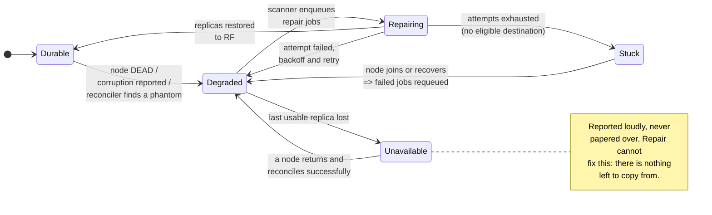
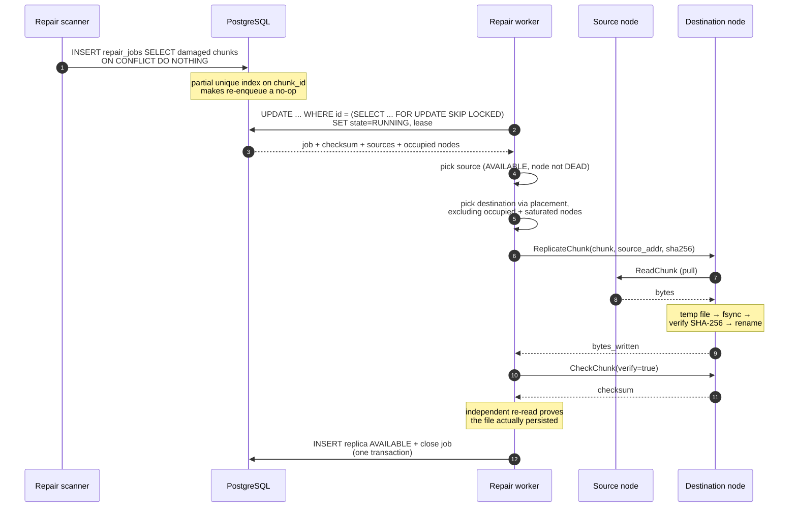
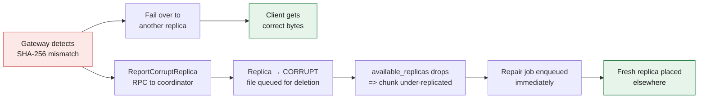

# Failure recovery

How FlexStore detects failures, what it does about them, and — equally
important — what it does **not** protect you from.

---

## Contents

- [The recovery loop](#the-recovery-loop)
- [Failure detection](#failure-detection)
- [False positives: when a healthy node is declared dead](#false-positives-when-a-healthy-node-is-declared-dead)
- [Under-replication detection](#under-replication-detection)
- [Re-replication](#re-replication)
- [The repair job queue](#the-repair-job-queue)
- [Read failover](#read-failover)
- [Corruption](#corruption)
- [Phantom replicas](#phantom-replicas)
- [Returning nodes and stale data](#returning-nodes-and-stale-data)
- [Over-replication and trimming](#over-replication-and-trimming)
- [What happens if PostgreSQL fails](#what-happens-if-postgresql-fails)
- [A chunk with no readable replica is a terminal state](#a-chunk-with-no-readable-replica-is-a-terminal-state-and-that-is-correct)
- [Remaining single points of failure](#remaining-single-points-of-failure)
- [Measured behaviour](#measured-behaviour)
- [Operator playbook](#operator-playbook)

---

## The recovery loop



Every transition is driven by one denormalised number,
`chunks.available_replicas`, maintained by a PostgreSQL trigger. Nothing in the
loop requires a component to notify another: a node dying demotes its replicas,
which decrements the counter, which makes the chunk appear in the repair
scanner's index range. The repair manager and the health monitor never talk to
each other directly.

---

## Failure detection

Heartbeat-based, with three states:

| State | Trigger | Effect |
|---|---|---|
| `HEALTHY` | heartbeat within `FLEXSTORE_SUSPECT_TIMEOUT` (15 s) | eligible for reads and writes |
| `SUSPECT` | no heartbeat for 15 s | excluded from **new placements**; existing replicas still readable |
| `DEAD` | no heartbeat for `FLEXSTORE_DEAD_TIMEOUT` (45 s) | replicas demoted to `UNAVAILABLE`, excluded from reads, counted as lost |

Two deliberate asymmetries:

- **Heartbeats can only promote.** A heartbeat moves a node towards `HEALTHY`.
  Only the coordinator's periodic sweep can demote it. That puts "how do we
  decide a node is gone" in exactly one place.
- **`SUSPECT` is a write-only exclusion.** A node that missed one heartbeat has
  almost certainly not lost its disks, so its data stays readable while it stops
  attracting new writes. Treating a brief blip as data loss would trigger a
  cluster-wide copy for nothing.

The demotion at `DEAD` is transactional with the health change
(`Store.SetNodeHealth`): a node cannot be `DEAD` while its replicas still read
`AVAILABLE`. This matters because durability is computed from a counter that
does **not** join `storage_nodes` — if the two could disagree, damage would be
invisible.

---

## False positives: when a healthy node is declared dead

This is the failure mode heartbeat systems actually hit in production, and it is
worth being precise about the cost.

A network partition, a long GC pause, or an overloaded node can stop heartbeats
from a machine whose disks are perfectly fine. FlexStore will then:

1. Mark it `SUSPECT` at 15 s → it stops receiving new writes.
2. Mark it `DEAD` at 45 s → its replicas are demoted, chunks become
   under-replicated, and the repair manager copies them elsewhere.

**What this costs:** wasted network and disk I/O for copies that were not
needed, and temporary over-replication. With `FLEXSTORE_REPAIR_MAX_PER_NODE`
bounding concurrent repairs per destination, this degrades throughput rather
than taking the cluster down.

**What it does *not* cost:** correctness. The false positive never destroys
data. The node's files are not deleted; they are demoted. When it returns, its
replicas are verified and either promoted back or trimmed as excess.

**Tuning the trade-off:**

| Goal | Change | Consequence |
|---|---|---|
| Fewer false positives | raise `FLEXSTORE_DEAD_TIMEOUT` | slower real recovery |
| Faster real recovery | lower `FLEXSTORE_DEAD_TIMEOUT` | more wasted repair on blips |
| Cheaper false positives | lower `FLEXSTORE_REPAIR_MAX_PER_NODE` | slower recovery overall |

The defaults (15 s / 45 s against a 5 s heartbeat) mean three consecutive missed
heartbeats before write exclusion and nine before data is written off. That is
deliberately conservative for a single-machine Compose cluster; a real
deployment across racks would want longer.

**What FlexStore does not do:** there is no quorum-based failure detector, no
phi-accrual estimator, and no gossip. A single coordinator's opinion is the
whole truth. A partition that isolates the *coordinator* from the storage nodes
would mark all of them dead, and repair would then fail for lack of any healthy
destination — loudly, and without deleting anything. That is a real limitation,
not a solved problem.

---

## Under-replication detection

A chunk is under-replicated when `available_replicas < replication_factor`,
counting only replicas in state `AVAILABLE`.

The detection is **index-driven, not a scan**:

```sql
CREATE INDEX chunks_durability_idx
    ON chunks (available_replicas, id)
    WHERE state = 'COMMITTED';
```

`available_replicas` is denormalised onto `chunks` and maintained by an
`AFTER INSERT OR UPDATE OF state OR DELETE` trigger on `chunk_replicas`. So:

- The durability query and the repair scanner both cost time proportional to the
  number of **damaged** chunks, not to the size of the dataset.
- The counter is exact within a transaction boundary by construction — the
  trigger fires in the same transaction as the replica change.

The previous milestone recomputed this with a `GROUP BY` over every chunk joined
to every replica, several times a minute. That is fine at 44 chunks and quietly
fatal at 44 million.

**The backstop.** `DurabilityAuditor` periodically recomputes every counter from
the underlying rows and reports drift as
`flexstore_durability_counter_drift_total`. It should always be zero; a non-zero
value means something wrote replica rows outside the intended path and
durability reporting cannot be trusted until it is explained.

Chunks whose owning object is `DELETING`/`FAILED` are excluded from all of this.
They are garbage awaiting the GC, and repairing them would burn bandwidth
restoring data that is about to be deleted.

---

## Re-replication



Properties, and why each is there:

| Property | Mechanism | Why |
|---|---|---|
| **Idempotent** | partial unique index on `(chunk_id) WHERE state IN (PENDING,RUNNING)`; replica insert is `ON CONFLICT DO UPDATE` | the scanner runs every 5 s; without this it would pile up duplicates for any repair slower than one interval |
| **Bounded concurrency** | `FLEXSTORE_REPAIR_WORKERS` total, `FLEXSTORE_REPAIR_MAX_PER_NODE` per destination | without the per-node cap, losing one node points every repair at whichever node looks emptiest and buries it |
| **No duplicate placement** | every node already associated with the chunk (in *any* replica state) is passed to the placement engine as `Exclude` | otherwise "3 replicas" could mean two copies on one machine |
| **Exponential backoff** | `BaseBackoff × 2^attempt`, capped at `MaxBackoff` | a chunk that cannot be placed must not spin |
| **Per-operation timeout** | `FLEXSTORE_REPAIR_JOB_TIMEOUT` on the copy RPC | a hung node cannot hold a worker forever |
| **Checksum verification** | destination verifies while writing, then the worker re-reads with `CheckChunk(verify=true)` | the write-path digest proves the bytes arrived; the re-read proves they persisted under the right name |
| **Pull, not push** | the destination fetches from the source | the copy work lands on the node gaining the replica; the coordinator never touches object bytes |

**When there is no source.** If every replica is unusable the job fails with
`ErrNoSource`, `flexstore_unavailable_chunk_events_total` increments, and an
ERROR is logged. Critically, **no metadata is destroyed** — the chunk keeps its
replica rows so a returning node can still be reconciled and restore the data.
The chunk is reported as unavailable rather than quietly forgotten.

**Terminal failure is deliberate.** After `FLEXSTORE_REPAIR_MAX_ATTEMPTS` a job
becomes `FAILED` and stops consuming worker slots. The chunk stays visible in
`flexstore_under_replicated_chunks`, so nothing is silently dropped. Failed jobs
are automatically requeued when a node joins or recovers, because "there was
nowhere to put it" is by far the most common terminal cause.

---

## The repair job queue

**Why PostgreSQL and not a real queue.** The semantics needed are: at-most-one
worker per job, survive coordinator restart, retry with backoff, and be
inspectable by an operator. `SELECT ... FOR UPDATE SKIP LOCKED` provides the
first, a lease column the second, two more columns the third, and it is all
already in the database that holds the metadata these jobs are about. Adding
Kafka or Redis Streams here would introduce a second consistency domain to keep
in sync with the thing it is describing.

**Concurrency model.**

```sql
UPDATE repair_jobs j
SET state = 'RUNNING', owner = $1, lease_expires_at = now() + $2, attempts = attempts + 1
WHERE j.id = (
    SELECT id FROM repair_jobs
    WHERE state = 'PENDING' AND next_attempt_at <= now()
    ORDER BY next_attempt_at, id
    LIMIT 1
    FOR UPDATE SKIP LOCKED
)
RETURNING ...
```

- `FOR UPDATE SKIP LOCKED` lets N workers claim concurrently without blocking
  each other and without ever handing one job to two workers. This holds across
  processes, so it already works for multiple coordinators even though only one
  runs today.
- The state flip and the lease are in the same statement as the selection, so
  there is no window where a job is selected but unclaimed.
- `attempts` increments on claim, not on failure — a worker that dies still
  burns an attempt, which is what stops a crash-looping repair from retrying
  forever.

**Job states:** `PENDING → RUNNING → SUCCEEDED | FAILED`, with `RUNNING →
PENDING` on lease expiry. Each row carries `attempts`, `last_error`,
`source_node_id`, `target_node_id` and `owner`, so a stuck repair can be
diagnosed from `GET /admin/replication` without reading logs.

**Restart safety.** On startup the repair manager reclaims every `RUNNING` job
whose lease has expired, and it does so immediately rather than waiting for the
lease to lapse naturally. A coordinator killed mid-copy loses at most the
in-flight transfers; the jobs return to `PENDING` and another worker picks them
up. Scenario D in the integration suite kills the coordinator mid-recovery and
asserts that recovery still completes with every object intact.

---

## Read failover

For each chunk, in order:

1. Get candidate replicas (`AVAILABLE`, on a node that is not `DEAD`).
2. Fetch from the first candidate. The storage node re-hashes as it streams and
   ends the stream with `FailedPrecondition` if its disk no longer matches.
3. The gateway **independently** verifies the SHA-256 over the wire.
4. On failure — unreachable, wrong length, or wrong digest — try the next
   replica.
5. Only when every replica has failed does the read fail.

**The partial-response problem.** A download is a stream; by chunk 40 of 128 the
client already holds 320 MiB. What happens if chunk 41 cannot be verified?

FlexStore's answer: **buffer and verify one chunk at a time before forwarding
any of its bytes.** A chunk is fetched into a chunk-sized buffer, verified, and
only then written to the response. So:

- Bytes that reach the client are always verified. There is no window in which
  unverified data is forwarded.
- If every replica of chunk 41 fails, the gateway has already sent a `200` and
  40 chunks. It cannot retract those, so it **aborts the connection**
  (`http.ErrAbortHandler`). The client sees a truncated transfer — a transport
  error, not a successful short read.

**The trade-off, stated plainly:** ~8 MiB of gateway memory per in-flight
download and a small per-chunk latency addition, in exchange for never serving a
byte we cannot vouch for. The alternative — streaming through and erroring at
the end — gives lower latency and *detects* corruption, but has already
delivered it.

`Content-Length` is set from metadata, so a well-behaved client also detects the
truncation by byte count.

---

## Corruption

Detection happens at four points: on write (the node verifies before making the
file visible), on read at the node, on read at the gateway, and during
reconciliation.

Detection alone heals nothing. The full path:



Notes:

- **`CORRUPT` is distinct from `UNAVAILABLE`** because the remedies differ:
  `UNAVAILABLE` waits for a node to come back, `CORRUPT` deletes the file and
  places a new copy. Collapsing them would mean waiting forever for bytes that
  are never going to become correct.
- **Wrong length counts as corruption.** A replica that returns a different
  number of bytes than metadata records is exactly as untrustworthy as one that
  returns the wrong bytes, and is reported the same way.
- **Reporting is synchronous but not on the critical path for correctness.** It
  has its own 5 s deadline and a detached context; if the coordinator is
  unreachable the read still succeeds and a warning is logged.
- **An unreachable node is not reported as corrupt.** Doing so would demote a
  perfectly good replica and trigger a pointless copy.

Injecting corruption for testing is done with `scripts/corrupt-chunk.sh`, which
writes to the container's filesystem from outside. There is deliberately **no
server-side corruption endpoint**: a "corrupt this chunk" API would be a
data-destruction primitive inside the production binary, one config flag away
from being reachable. The server has no such capability at all, which is a
stronger guarantee than a well-guarded one.

---

## Phantom replicas

A **phantom** is the inverse of stale data: metadata records an `AVAILABLE`
replica, but the node does not hold the file. Every subsystem that can discover
one is able to correct it, because a phantom is a durability lie — a cluster
claiming three copies while holding two:

| Discoverer | How it notices | Response |
|---|---|---|
| Gateway read | fetch fails over | reports it; the replica row is dropped |
| Reconciler | inventory diff on a returning node | drops the row (chunk becomes repairable) |
| **Repair source probe** | a pull fails, and the source itself answers "not here" | drops the row, invalidates the cached layout |

The third row exists because of a failure observed on a slow CI runner: a
repair job pulled from a phantom source, got NotFound, retried the same source
— the only recorded `AVAILABLE` copy — and burned its whole retry budget
against a file that did not exist. Repair was the one consumer of replica
metadata that could not shed a phantom. It now asks the failed source directly
(`CheckChunk`), and drops the row only on a **positive** "I am up and I do not
have it" — a transport error keeps the row, because an unreachable node's
replicas are the health monitor's call, not repair's.

---

## Returning nodes and stale data

**The rule: metadata is the source of truth; a returning node's files are
evidence, not authority.**

When a node rejoins:

1. Its replicas are demoted from `UNAVAILABLE` to `STALE`. `STALE` does not
   count towards durability and is not offered to readers.
2. A reconciliation job is queued.
3. The reconciler streams the node's actual inventory (`ListChunks`) and
   compares it against metadata.

Three classes of disagreement, three remedies:

| Class | Meaning | Action |
|---|---|---|
| **verified** | metadata says the node has it, and it does, with a matching SHA-256 | promote `STALE` → `AVAILABLE` |
| **phantom** | metadata claims it, the disk does not have it (or the bytes are wrong) | drop the replica row → chunk becomes under-replicated → repair |
| **orphan** | the node has a file metadata knows nothing about | queue the file for deletion |

Orphans are the normal case for a node that was down while objects were deleted.
`chunk_deletions` deliberately has **no foreign key onto `chunks`** precisely so
this works: by definition the chunk row is already gone.

**Why not just trust the returning node?** Its disk could have been rolled back
by a snapshot restore, truncated by a bad shutdown, or filled with copies of
objects that were deleted meanwhile. The previous milestone restored replicas
optimistically on rejoin; that made a returning node's stale files instantly
authoritative for durability accounting. The reconciler replaces optimism with
verification.

**Cost.** Reconciliation with `FLEXSTORE_RECONCILE_VERIFY_CHECKSUMS=true`
re-hashes every chunk on the returning node. On a node holding terabytes that is
expensive. Setting it to `false` checks presence and size only — reads still
verify checksums either way, so this trades scrub depth, not safety.

Reconciliation can also be triggered manually: `POST /admin/reconcile?node=ID`.
It only ever makes the cluster's view more conservative, so it is safe to invoke
at any time.

### The STALE deadlock, and why the reconciler sweeps

Enqueue-on-rejoin alone is not sufficient, and the failure it produces is worth
recording because it was found by running the real cluster, not by reasoning.

A reconciliation can be lost two ways: it can **FAIL** (the node was still
starting when its inventory was requested — `Unavailable: name resolver error`),
or it can be **dropped by the idempotence check** if the node flaps while one is
already `RUNNING`. Nothing retried it.

That is worse than a missed verification, because `STALE` replicas are excluded
from durability **and** they occupy their node. A chunk whose every remaining
node holds a `STALE` copy is therefore:

- permanently under-replicated (the STALE copies do not count), and
- unrepairable (every node is in the placement `Exclude` set).

Observed in a real run: 6 chunks stuck at 2-of-3 with 32 `STALE` replicas across
three nodes, repair retrying and failing indefinitely with *"insufficient
healthy storage nodes: need 1, have 0 eligible of 5 known"*.

Two changes fixed it:

1. **The reconciler sweeps on the condition, not the event.** Every tick it
   queues reconciliation for any `HEALTHY` node that still holds `STALE`
   replicas, whatever the reason. `STALE` is now self-resolving.
2. **Repair defers instead of failing.** When the only blocker is that every
   candidate node holds an unverified copy, the job closes as a no-op rather
   than burning its retry budget on a placement that cannot succeed. The
   scanner re-enqueues if the chunk is still short after reconciliation.

After the fix the same stuck state cleared in **9 seconds**: all 32 stale
replicas verified and promoted, under-replicated back to 0.

The general lesson: a state that is both *excluded from durability* and
*occupying a resource* needs a path out that does not depend on the event that
created it.

### Generalising the deferral: transient occupancy

`STALE` turned out not to be the only state with that shape. The destination
rule is "never place a second copy on a node that already has a replica row for
this chunk", and that rule reads `chunk_replicas` in **every** state. So a node
is equally blocked when it holds:

| Blocking state | Cleared by | Typical latency |
|---|---|---|
| `STALE` | the reconciler verifying it | seconds |
| `CORRUPT` | the GC deleting the bad file and dropping the row | one GC interval |
| `DELETING` | the GC | one GC interval |
| `UNAVAILABLE` | the node returning, or the row being reclaimed | node-dependent |
| `WRITING` | `CommitChunk` | milliseconds |

None of these is permanent, but each one makes placement fail *right now*. A
chunk that is under-replicated while every remaining node is blocked this way
would burn its five attempts in about a minute and land in `FAILED` — where it
stays until a node joins or an operator intervenes, even though the blockage
usually clears seconds later.

This was observed on a long-lived development cluster: after the corruption
tests had deliberately destroyed replicas on several nodes, a chunk was left
under-replicated with *"insufficient healthy storage nodes: need 1, have 0
eligible of 4 known"* and four repair jobs in `FAILED`.

`RepairTarget.TransientOccupancy` now counts occupied nodes whose replica is
not `AVAILABLE`, and repair defers — closes the job as a no-op — whenever
placement fails and that count is non-zero. Deferring loses nothing, because
under-replication is **derived state, not a queue entry**: the durability
scanner recomputes it from `chunks.available_replicas` every 5 s and re-enqueues
the chunk the moment a destination exists.

The distinction being drawn is between *"there is nowhere to put a copy"* and
*"there is nowhere to put a copy yet"*. Only the first deserves a retry budget.

---

## Over-replication and trimming

Recovery is bidirectional and the reverse direction is easy to forget.

A node dies → its chunks are re-replicated elsewhere → the node returns → its
copies are verified and promoted. The chunk now has **RF + 1** replicas. Without
trimming, every node failure permanently inflates storage for the affected
chunks — measured at 33% in a 3-replica cluster during development.

`TrimOverReplicatedChunks` removes the excess, dropping from the **fullest**
nodes first so trimming doubles as gentle rebalancing. It runs in the repair
scanner, which is the component that owns "replication equals RF" in both
directions.

Safety is structural: the number of rows to demote is computed as
`available_replicas - RF` inside the same statement that selects them, under a
row lock, and only `AVAILABLE` rows are eligible. It cannot take a chunk below
the replication factor even racing with a repair.

---

## What happens if PostgreSQL fails

Bluntly: **the cluster stops serving.**

| Failure | Effect |
|---|---|
| PostgreSQL unreachable | The coordinator's `/readyz` fails. No uploads (no `BeginUpload`), no downloads (no `GetObject` unless the layout is cached in Redis and within its TTL). Storage nodes keep running and keep their data; nothing is lost. |
| PostgreSQL data loss | **Catastrophic.** Object → chunk mapping, chunk ordering, checksums and replica locations all live only there. The storage nodes would hold millions of files named by UUID with no way to reassemble them into objects. |
| PostgreSQL slow | Everything slows. The control plane is on the path of every request even though object bytes are not. |

**There is no replication or backup of PostgreSQL in this project.** A single
`postgres` container with a single volume. That is the largest gap between
FlexStore and something you could run against real data, and it is not disguised
anywhere in this repository.

What *would* be needed: streaming replication with a hot standby, PITR via WAL
archiving, tested restore procedures, and a coordinator that can fail over
between primaries. None of it exists.

What FlexStore does do correctly: it treats PostgreSQL as the sole source of
truth and never invents metadata to work around its absence. A coordinator that
cannot reach the database refuses traffic instead of guessing.

---

## A chunk with no readable replica is a terminal state, and that is correct

When every replica of a chunk is corrupt or gone, repair cannot fix it. There is
nothing to copy from. FlexStore's response is deliberate and worth stating,
because the alternatives are all worse:

- The chunk is reported as **unavailable** (`flexstore_unavailable_chunks`,
  `/admin/health` returns 503), not merely under-replicated. Those are different
  problems and conflating them would hide the serious one.
- Its **metadata is preserved**. The replica rows stay, so a node that returns
  with the bytes still on disk can be reconciled and the data recovered. Deleting
  the rows would make the loss permanent in exchange for a tidier dashboard.
- Its repair jobs **exhaust their retries and stop**, ending in `FAILED` with the
  last error recorded. That is the honest record of a chunk that needs a human.

The consequence for testing is that cluster-wide durability does not return to
zero on its own after this state is entered — and it should not, because
pretending otherwise would mean a permanently-lost chunk eventually stops being
reported.

The integration suite creates this state on purpose
(`TestAllReplicasCorruptFailsLoudly` destroys every replica of an object to
prove FlexStore refuses to serve bad bytes). That makes cluster-wide durability
an unsound assertion for any *other* scenario in the same run, which is why the
failure scenarios assert on **their own object's** replica counts rather than on
a global counter. A scenario that waited for cluster-wide zero would be waiting
for something the suite itself made impossible, and would report a failure that
had nothing to do with the code under test.

---

## Remaining single points of failure

| Component | Redundant? | Impact when it fails |
|---|---|---|
| **Coordinator** | ❌ single instance | No uploads, no downloads. Data intact. Restart takes seconds and repair resumes automatically. |
| **PostgreSQL** | ❌ single instance, no backup | Serving stops. Data loss here is unrecoverable. |
| Gateway | ⚠️ stateless, but one instance in Compose | Run several behind a load balancer; nothing in the design prevents it. |
| Redis | ✅ optional | Cluster fully functional, just more database traffic. |
| Storage nodes | ✅ RF=3 across 5 | Survives 2 simultaneous failures for reads; repair restores durability. |
| Prometheus / Grafana | ✅ observability only | No effect on serving. |

The repair queue is *designed* for multiple coordinators — `FOR UPDATE SKIP
LOCKED` claiming, per-instance lease ownership, lease reclamation — but only one
coordinator runs. Making it HA needs leader election for the singleton workers
(health sweep, GC), not a redesign of the queue.

**Failure domain.** Everything runs on one machine, in one Docker network, on
one physical disk. Five "storage nodes" sharing a disk provide no protection
against that disk failing. FlexStore demonstrates the *mechanics* of
distributed durability, not durability itself.

---

## Measured behaviour

From `make benchmark-recovery` on this repository (5 nodes, RF=3, 8 MiB
chunks, all containers on one laptop): each trial uploads a 512 MiB object (64
chunks), stops the node holding the most of it, and samples the cluster every
250 ms while issuing continuous read probes. Raw JSON is committed under
[`benchmarks/results/published/`](../benchmarks/results/published/).

| | Trial 1 | Trial 2 | Trial 3 |
|---|---:|---:|---:|
| Chunks with a copy on the victim | 43 of 64 | 46 of 64 | 49 of 64 |
| Node stop → declared `DEAD` | 43.3 s | 47.8 s | 46.5 s |
| Peak under-replicated chunks | 44 | 46 | 50 |
| `DEAD` → all copies rebuilt | **13.0 s** | **8.2 s** | **9.5 s** |
| Re-replication rate (4 workers) | 27 MiB/s | 45 MiB/s | 42 MiB/s |
| Read probes during recovery | 236/236 OK | 235/235 OK | 213/213 OK |
| Read p95 during recovery | 43 ms | 43 ms | 43 ms |
| SHA-256 after recovery | match | match | match |
| Chunks ever unavailable | 0 | 0 | 0 |

The integration suite additionally kills **two** nodes in sequence
(`TestScenarioB_TwoNodesDie`): the object stayed downloadable with 2 of 5
nodes stopped, and durability was restored 9.1 s after the second node was
declared dead.

**Detection dominates recovery time.** ~45 s to notice a dead node, ~10 s to
rebuild ~370 MiB of lost replicas. The copies are fast; noticing is slow, and
it is slow by choice — the thresholds trade false-positive cost against
recovery speed. On a real network you would tune them differently than on a
laptop.

One caveat on reading the demo's own output: `flexstore_under_replicated_chunks`
is a gauge refreshed by the durability scanner, so in the seconds right after a
recovery it can still report the pre-repair value while `/admin/replication` —
which queries PostgreSQL directly — already reads zero. The API is the
authority; the gauge is at most one scan interval behind.

---

## Operator playbook

**A node is DEAD.**

```bash
curl -s localhost:8080/admin/nodes | python3 -m json.tool
docker compose logs storage-node-N | tail -50
docker compose start storage-node-N   # if it should come back
```

Repair starts automatically. If the node is permanently gone, nothing further is
needed — the replicas have already been rebuilt elsewhere.

**Under-replication is not clearing.**

```bash
curl -s localhost:8080/admin/replication | python3 -m json.tool
```

Look at `repair_jobs_failed` and `recent_jobs[].last_error`. The usual causes:

- Fewer healthy nodes than the replication factor — nowhere to put a copy.
- Every healthy node already holds a copy of the affected chunk.
- A destination node is full (placement requires 2× chunk size of headroom).

Adding or restarting a node automatically requeues failed jobs.

**Chunks are UNAVAILABLE.**

Repair cannot help; there is nothing to copy from. Check whether any `DEAD` node
still has its disk before wiping it — bringing it back and letting the reconciler
verify its files is the only recovery path.

```bash
curl -s localhost:8080/admin/replication | python3 -c 'import json,sys; print(json.load(sys.stdin)["unavailable_chunks"])'
```

**Checksum failures are appearing.**

```bash
docker compose logs | grep -i checksum
curl -s localhost:9101/metrics | grep checksum_failures
```

The affected replica is already demoted and replaced automatically. Repeated
failures on one node point at failing hardware.

**Forcing a reconciliation.**

```bash
curl -X POST 'localhost:8080/admin/reconcile?node=storage-node-3'
curl -X POST 'localhost:8080/admin/reconcile'   # all nodes
```

**Watching a recovery live.**

```bash
watch -n1 'curl -s localhost:8080/admin/replication | python3 -m json.tool'
```

Or open the built-in dashboard at **http://localhost:8080/dashboard** and watch
the node turn red, the repair queue drain, and durability come back. Grafana
(**localhost:3000** → FlexStore → Self-Healing) shows the same recovery from
the metrics side, with history.
